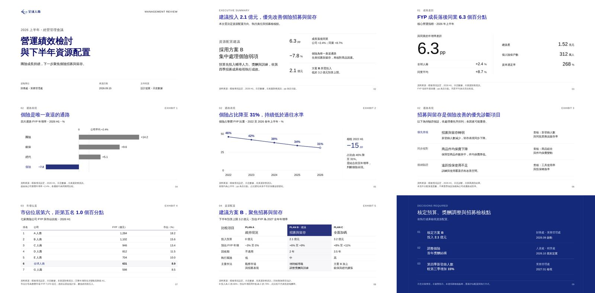
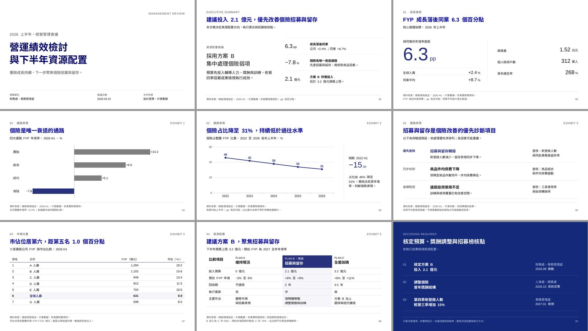
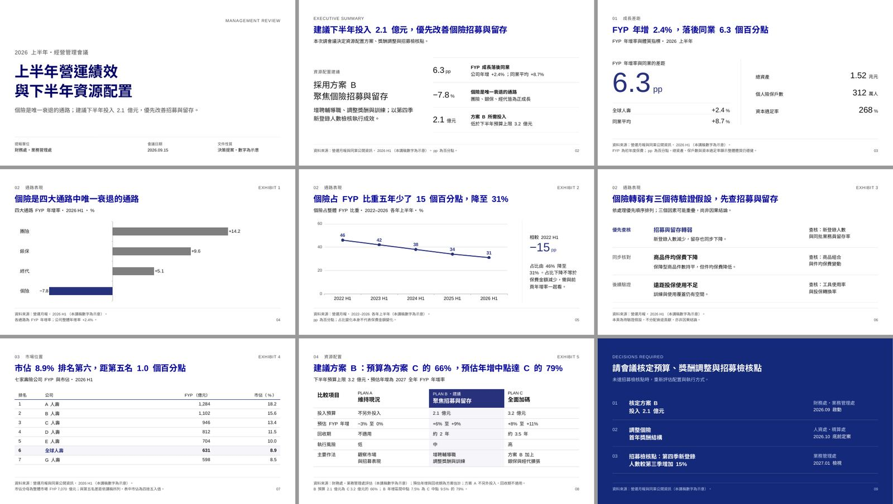
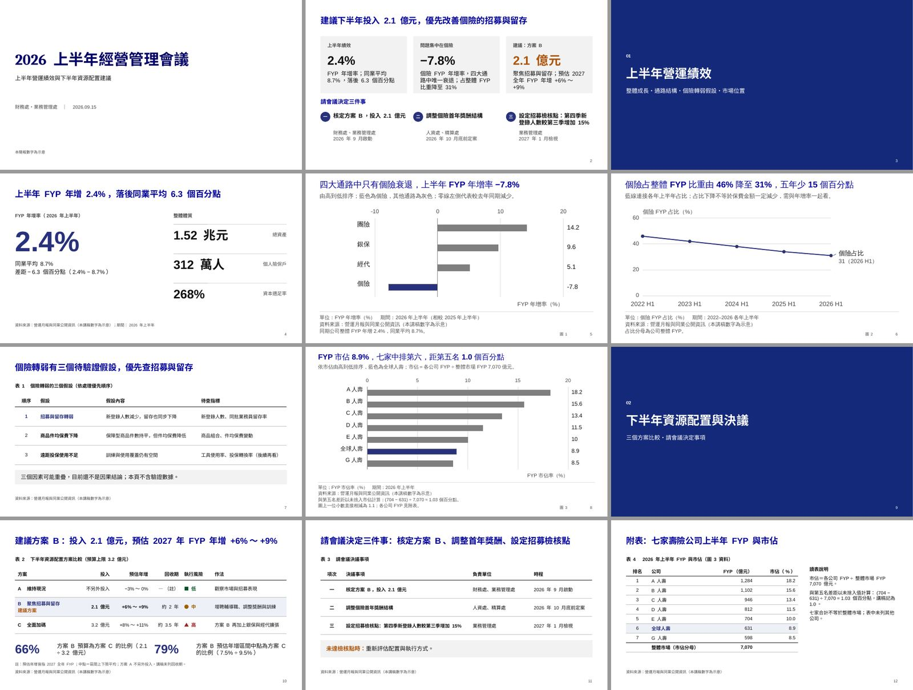
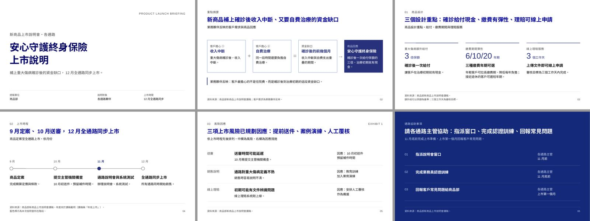
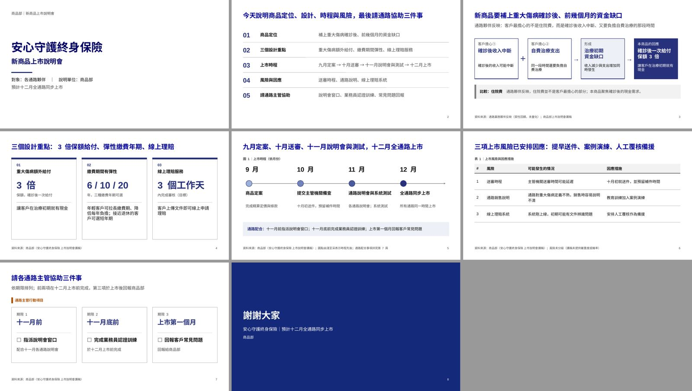
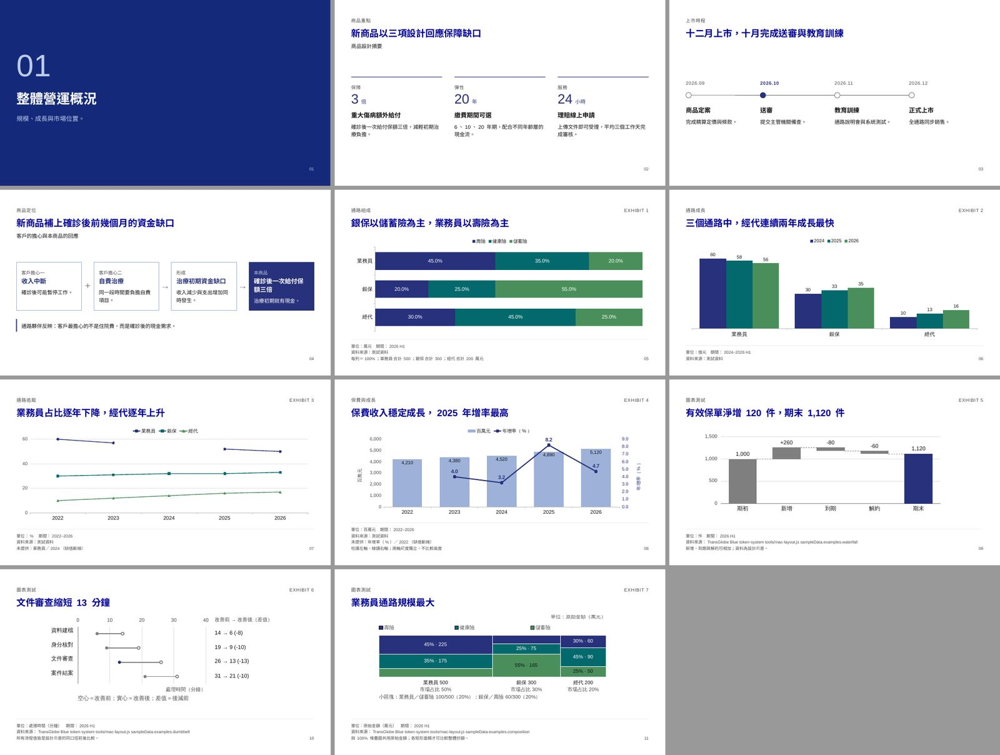

# iysl-transglobe：文字稿成簡報的改版與驗收

日期：2026-10-02

## 問題

使用者回報舊版「成品簡陋、圖少」，期待只給文字稿就能做出成品，並偏好 Office 原生圖表。
比對原型（`visuals` 的簡報樣板與網站 v2.5.1）後，原因是舊版只帶走原型的零件（色票、字型、18 種圖），
沒有帶走頁面組成：原型 9 頁正式內容中，封面、主管摘要、診斷優先序、方案比較、決議事項 5 種頁型在 skill 裡都不存在，
而 references 還寫明「版型是校準材料，不是輸出範本」。規則約 390 行、多為禁止句，原型本身只用四句原則加完整範例傳達設計意圖。

## 改了什麼

- 主流程改為「文字稿 → 故事線 → 每頁版型與主視覺 → `deck.json` → PPTX」。
- `scripts/build-deck.js`：依原型版面產生 16:9 PPTX，12 種頁型（原型 9 頁加上 `columns`、`process`、`flow`、`chapter`）。
  文字與表格為原生物件；`ranking`、`ordered`、`trend`、`tracking`、`grouped`、`stacked`、`sharetrend`、`combo`
  為可「編輯資料」的原生圖表（`scripts/native-charts.js`）；其餘圖型嵌入 SVG 並以 resvg 產生真正的 PNG 後備。
  中文字型、佈景主題色與語系在後處理設定；溢出風險以 `WARN` 回報，不直接拒絕。
- `render-chart.js` 新增 `bare` 模式（只畫圖，標題與頁尾交給投影片）；`ranking`、`trend` 的 `focus` 改為可選。
- SKILL.md 以原型的四句原則加四條資料底線為核心；references 改寫並新增 `page-layouts.md`，
  `assets/example-deck.json` 是原型九頁的可建置版本。

## 驗收方式

兩份文字稿（`management-review`：原型九頁倒推的經營會議講稿；`product-launch`：幾乎沒有數字的商品說明講稿），
各由未參與實作的 agent 只拿 skill 與講稿完成，舊版 skill 為對照組。輸出以 LibreOffice 轉圖檢視
（替代字型，只驗版面）。第一輪後依觀察新增 `flow` 頁型與摘要頁指引，`product-launch` 新版重跑一次。

| 案例 | 版本 | 頁數 | 原生圖表 | SVG 圖 | 數字遺漏 | 時間 | tokens |
| --- | --- | ---: | ---: | ---: | --- | ---: | ---: |
| management-review | 新版 | 9 | 2 | 0 | 無 | 118 s | 118k |
| management-review | 舊版 | 12 | 0 | 3 | 無 | 577 s | 209k |
| product-launch | 新版（第二輪） | 6 | 0 | 0 | — | 158 s | 122k |
| product-launch | 舊版 | 8 | 0 | 0 | — | 316 s | 143k |

觀察：

- 新版兩份成品的版面與原型一致（頁首位置、字級、EXHIBIT、頁尾來源），圖表可在 PowerPoint 編輯；
  講稿全文放在各頁講者備忘稿。
- 舊版在這個環境並不簡陋，但每次都從零寫一套建置程式與字型修補腳本，耗時 2–5 倍；
  圖表是不可編輯的 SVG，圖表頁的標題位置與其他頁不同。
- 舊版商品說明稿用了「問題 → 回應」方框圖，第一輪新版沒有對應頁型，因此新增 `flow`；第二輪新版的摘要頁即改用它。
- 尚未驗證：Windows／Mac PowerPoint 實機開啟、Office Web、列印與 PDF 輸出。

## 成品對照

原型（簡報樣板 9 頁）：

`assets/example-deck.json` 以新版建置：

management-review，新版（上）與舊版（下）：

product-launch，新版第二輪（上）與舊版（下）：

所有頁型與兩種圖表路徑（測試 fixture）：

