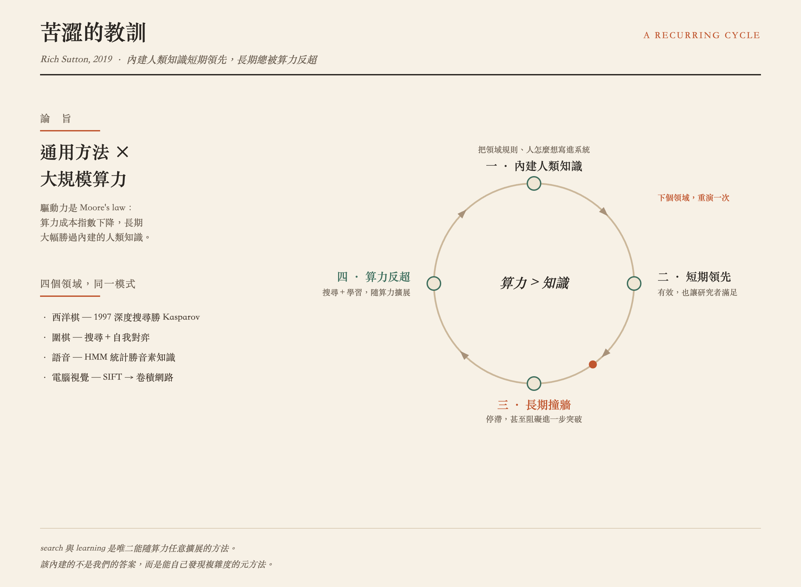

# Style Range — One Diagram, Three Houses

The same content — Rich Sutton's *The Bitter Lesson* as a four-step recurring
`loop` — rendered in three visibly different visual houses. The claim, fact list,
relation, and seamless-loop motion stay fixed; the **visual treatment and spatial
staging** can change.

This showcase exists to make one rule concrete: **the relation fixes semantic
geometry, but not the publication look or the page wireframe.** See
[`references/style-directions.md`](../../references/style-directions.md) for the
divergence axes and the calibration family these draw from.

| Direction | Poster | Visual fingerprint | Spatial fingerprint |
| --- | --- | --- | --- |
| [editorial](editorial/) |  | light · blue mono+accent · geometric sans · flat | centered hero · symmetric · rounded-card containment |
| [blueprint](blueprint/) |  | dark · cyan+amber · mono · ruled grid · soft-glow | centered hero · symmetric · technical frame |
| [print](print/) |  | warm paper · pine+terracotta · serif · hairline print | off-center hero · asymmetric · left reading column · open annotations |

Each `diagram.svg` loops on its own in any browser and passes
`scripts/render_svg.py --check`. The `print` skin failed the text-collision gate on
its first pass and was fixed before landing — relaxing the aesthetic did not relax the
readability floor.

## The point

A weak version of this skill makes every diagram look like the `editorial` direction.
The editorial/blueprint pair deliberately keeps a similar wireframe to isolate visual
divergence; the print direction also changes spatial staging. Production candidates
must do both: differ on at least one visual axis and at least one spatial axis, while
deriving both choices from the content rather than copying any of these three.
